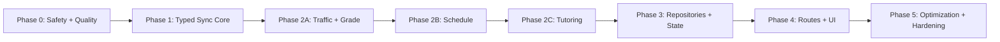

# MyCCU Refactor Program Implementation Plan

> **For agentic workers:** REQUIRED SUB-SKILL: Use superpowers:subagent-driven-development (recommended) or superpowers:executing-plans to implement this plan task-by-task. Steps use checkbox (`- [ ]`) syntax for tracking.

**Goal:** Migrate MyCCU to the approved secure, typed, feature-first architecture through eight independently testable and releasable implementation plans.

**Architecture:** Use an incremental strangler migration: establish security and quality gates, replace the untyped queue behind compatibility facades, extract WebView workflows, move persistence behind account-scoped repositories, then simplify routes and UI. Every plan keeps the app buildable and requires an Expo Go acceptance checkpoint before the next plan starts.

**Tech Stack:** Expo SDK 54, React Native 0.81, React 19, TypeScript 5.9, Expo Router, React Native WebView, Zustand, AsyncStorage, SecureStore, Jest, Testing Library, Playwright, GitHub Actions.

---

## Authoritative inputs

- Architecture: `docs/superpowers/specs/2026-07-11-myccu-refactor-architecture-design.md`
- Baseline command: `npm run verify`
- Current verified baseline: 22 test suites, 153 tests, zero failures.
- Current coverage baseline: 34.08% lines, 24.64% branches.
- Current install caveat: `npm ci --legacy-peer-deps` is required because the lockfile resolves `react-dom@19.2.5` beside `react@19.1.0`. Phase 0 makes plain `npm ci` reproducible.
- Current audit baseline: 44 npm advisories (3 low, 28 moderate, 12 high, 1 critical). Phase 0 triages reachable production risk; never run `npm audit fix --force` as a blanket action.
- Development acceptance constraint: each plan must pass its Expo Go checklist. Production-only capabilities remain behind runtime adapters and receive development-build/EAS preview checks.

## Plan dependency graph



The workflow plans are sequential because they modify the same WebView host and registry. Do not execute Phase 2A, 2B, and 2C in parallel in one worktree.

## Plan set

| Order | Plan | Outcome |
|---:|---|---|
| 0 | `2026-07-11-myccu-phase-0-safety-quality.md` | Secure credentials and WebView boundary; reproducible strict CI baseline. |
| 1 | `2026-07-11-myccu-phase-1-typed-sync-core.md` | Typed, generation-safe coordinator behind compatibility facades. |
| 2 | `2026-07-11-myccu-phase-2a-traffic-grade-workflows.md` | Traffic and grade leave the legacy WebView branch. |
| 3 | `2026-07-11-myccu-phase-2b-schedule-workflow.md` | Schedule navigation, extraction, and retries become a pure workflow. |
| 4 | `2026-07-11-myccu-phase-2c-tutoring-workflows.md` | Tutoring overview, detail, download, and upload become typed workflows. |
| 5 | `2026-07-11-myccu-phase-3-repositories-state.md` | Versioned account-scoped repositories become the only persistence owners. |
| 6 | `2026-07-11-myccu-phase-4-routes-ui.md` | Canonical routes, stable IDs, view-models, and focused UI sections. |
| 7 | `2026-07-11-myccu-phase-5-optimization-hardening.md` | Performance ratchet, dependency/repo cleanup, docs, and release hardening. |

## Program execution rules

- [ ] **Step 1: Create an implementation worktree from the accepted planning branch**

Use `superpowers:using-git-worktrees`. The implementation worktree must not be the planning worktree that stores these documents.

Run:

```powershell
git status --short --branch
git worktree list
```

Expected: the selected implementation branch starts from the commit containing the approved spec and all eight plan files; no unrelated change is staged.

- [ ] **Step 2: Establish the pre-Phase-0 baseline**

Run:

```powershell
npm.cmd ci --legacy-peer-deps
npm.cmd run verify
```

Expected: dependency installation exits 0; TypeScript passes; 22 suites and 153 tests pass. Record deviations before editing product code.

- [ ] **Step 3: Execute exactly one phase plan at a time**

Open the next plan file, use its required TDD steps and commits, and stop at its Expo Go checkpoint. Do not begin the next plan while any automated or manual exit criterion remains open.

- [ ] **Step 4: Tag every phase completion in Git history**

After each phase's final verification commit, create its exact annotated local tag:

```powershell
git tag -a myccu-refactor-phase-0 -m "MyCCU refactor phase 0 verified"
git tag -a myccu-refactor-phase-1 -m "MyCCU refactor phase 1 verified"
git tag -a myccu-refactor-phase-2a -m "MyCCU refactor phase 2a verified"
git tag -a myccu-refactor-phase-2b -m "MyCCU refactor phase 2b verified"
git tag -a myccu-refactor-phase-2c -m "MyCCU refactor phase 2c verified"
git tag -a myccu-refactor-phase-3 -m "MyCCU refactor phase 3 verified"
git tag -a myccu-refactor-phase-4 -m "MyCCU refactor phase 4 verified"
git tag -a myccu-refactor-phase-5 -m "MyCCU refactor phase 5 verified"
```

Run only the command for the completed phase. Push tags only when the user requests publication.

- [ ] **Step 5: Preserve compatibility only until its final consumer migrates**

Every phase plan names the compatibility facade it introduces or consumes. Delete a facade in the first phase whose end state has no remaining consumer; do not carry obsolete paths into Phase 5.

- [ ] **Step 6: Run the program-level verification after every phase**

Before Phase 0 fixes the install baseline:

```powershell
npm.cmd run verify
```

After Phase 0:

```powershell
npm.cmd run verify
npm.cmd run coverage:ci
npm.cmd run export:smoke
```

Expected: every command exits 0, global coverage does not fall below the ratchet stored by Phase 0, and the Expo export smoke produces all configured bundles in a temporary/ignored directory.

- [ ] **Step 7: Complete the phase-specific Expo Go checkpoint**

Use the checklist embedded in the active phase plan. Capture pass/fail, device OS, Expo Go version, and commit SHA in its exact evidence file: `myccu-refactor-phase-0.md`, `phase-1.md`, `phase-2a.md`, `phase-2b.md`, `phase-2c.md`, `phase-3.md`, `phase-4.md`, or `phase-5.md` under `docs/verification/`. The document must contain no account, password, HTML, course content, or full URL query.

- [ ] **Step 8: Review architecture drift before advancing**

Run:

```powershell
npm.cmd run lint:boundaries
rg -n "Promise<any>|Record<string, unknown>|originWhitelist=\{\['\*'\]\}|user_credentials_cache_v1" src app
```

Expected after the responsible phase removes each pattern: `lint:boundaries` exits 0 and `rg` returns no production matches except an explicitly named migration constant/test fixture.

## Program-level completion checklist

- [ ] Credentials persist only in SecureStore; the AsyncStorage credential mirror is removed and migrated safely.
- [ ] WebView navigation and messages are validated by host, request, generation, nonce, state, and payload schema.
- [ ] `core/sync` imports no feature implementation.
- [ ] Traffic, grade, schedule, and every tutoring operation use registered typed workflows.
- [ ] Repositories own all feature persistence and publish stores only after generation promotion.
- [ ] Logout/account switching aborts browser work and clears queue, credentials, cache, and UI state.
- [ ] Home and screens perform no direct feature storage access.
- [ ] Routes are canonical and route params use stable IDs rather than serialized domain payloads.
- [ ] Legacy WebView orchestration branches and the untyped engine facade are deleted.
- [ ] Strict typecheck, lint, format, coverage, CI, export smoke, Expo Go, live PCCU, and EAS preview gates pass.
- [ ] Performance medians remain within the approved 15% local regression ceiling.
- [ ] Repository contains no copied sample app, tracked debug capture, obsolete migration script, or verified unused direct dependency.

## Final integration handoff

After Phase 5, use `superpowers:requesting-code-review`, then `superpowers:finishing-a-development-branch`. The final review must compare the implementation against every checkbox above and the design completion criteria in the architecture spec before merge or PR publication.
