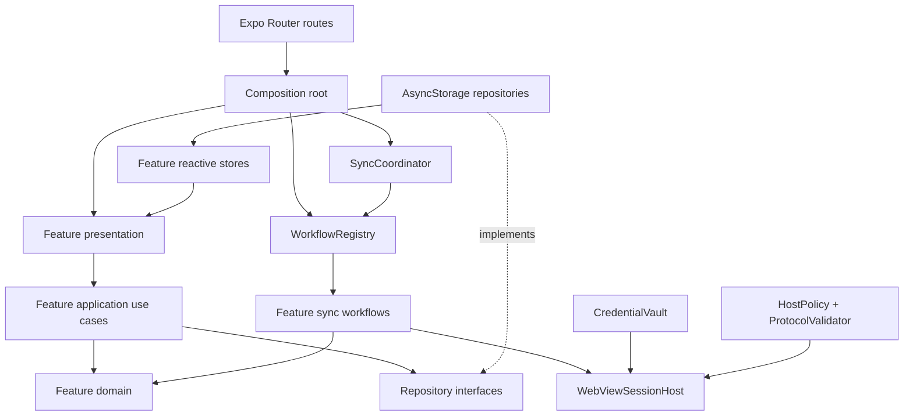

# MyCCU Refactor Architecture Design

**Date:** 2026-07-11

**Status:** Validated design; pending written-spec review

**Primary target:** Production-quality mobile app architecture
**Development constraint:** Every migration stage must remain testable in Expo Go

## 1. Executive decision

MyCCU will be refactored as a typed, feature-first modular monolith using an incremental strangler migration. The current product behavior remains available while new security, sync, repository, and presentation boundaries replace the corresponding legacy responsibilities one workflow at a time.

The first priority is security and synchronization correctness. UI decomposition and performance cleanup follow after the data path has one owner and deterministic lifecycle semantics. Expo Go is a required development acceptance environment, but it does not define the production architecture or prevent development-build capabilities from being isolated behind adapters.

## 2. Goals

1. Remove plaintext credential storage and define an explicit WebView trust boundary.
2. Make every sync request typed, cancellable, generation-safe, and exactly-once settled.
3. Give each feature one repository for persistence and one reactive store projection for UI state.
4. Prevent cross-account cache and WebView-session leakage.
5. Split the shared WebView God Object into a session host plus independent feature workflows.
6. Move domain contracts out of transport/parser files and enforce dependency direction.
7. Make Expo Router files thin and establish canonical feature route entry points.
8. Decompose large screens into route, view-model, composition, and section responsibilities.
9. Add strict type, lint, coverage, CI, export, observability, and Expo Go acceptance gates.
10. Improve startup and sync efficiency by removing duplicate hydration, focus-time storage reads, and redundant background requests.

## 3. Non-goals

- Rewriting the application in another framework.
- Replacing Expo Router, Zustand, AsyncStorage, SecureStore, or React Native WebView without evidence that an adapter cannot satisfy the design.
- Building a backend proxy for PCCU credentials or scraping.
- Redesigning the visual language while architectural boundaries are being migrated.
- Adopting a state-machine library in the first migration. The workflow reducer and effects remain local TypeScript until their complexity proves a library is necessary.
- Making live PCCU availability a blocking condition for every pull request.

## 4. Current baseline and risks

### 4.1 Verified baseline

- `npm run verify` passes.
- 22 of 22 Jest suites pass; 153 tests pass.
- Full `src` coverage is 34.08% lines and 24.64% branches.
- There are 101 production TypeScript/TSX files and 22 test files.
- Strict TypeScript checking exposes four existing errors, all in tests.
- The only pre-existing worktree change is `.codex/environments/environment.toml`; it is outside this design and must remain untouched.

### 4.2 Structural hotspots

- `src/features/pccu/engine/GlobalScraperWebView.tsx` is approximately 1,500 lines and owns browser lifecycle, three state machines, navigation, message routing, parsing, persistence, Zustand updates, retries, and debug UI.
- `src/features/pccu/sync/pccuSyncScripts.ts` exceeds 2,400 physical lines.
- `src/features/tutoring/screens/TutoringCourseDetailScreen.tsx`, `src/features/schedule/screens/ScheduleScreen.tsx`, and `src/features/home/screens/HomeScreen.tsx` each mix domain calculation, I/O, orchestration, and rendering.
- The `pccu` parser module owns schedule and grade domain types consumed by home, notifications, routes, storage, state, and UI.
- Home reads storage directly while feature stores also hydrate the same storage.

### 4.3 Security and correctness risks

- `authService.ts` mirrors the full account and password into AsyncStorage under `user_credentials_cache_v1`, then reads that mirror before SecureStore.
- The shared WebView accepts broad navigation and message inputs; message payloads are not tied to a request generation or runtime schema.
- Logout does not atomically abort the engine, clear the WebView session, clear credential refs, and purge every account-scoped feature cache.
- A timed-out executor promise can settle late and interfere with a later request's timer/state.
- Queue clearing and destruction can leave queued callers unresolved.
- Storage modules frequently catch write failures while the sync path still reports success.
- Tutoring persists related data across several keys without a generation commit point.

## 5. Strategy decision

### 5.1 Selected: incremental strangler migration

New contracts and adapters are introduced beside the current APIs. Existing hooks and routes temporarily delegate through compatibility facades. Each feature workflow is characterized, extracted, switched, verified in Expo Go, and only then removed from the legacy WebView component.

Benefits:

- Every step is releasable and reversible.
- Existing HTML fixtures and WebView tests continue protecting behavior.
- Security fixes land before a broad UI rewrite.
- Traffic, grade, schedule, and tutoring can migrate independently.

Cost:

- The repository temporarily contains both legacy facades and new internals.
- Boundary tests are required to prevent new code from flowing back into the old structure.

### 5.2 Rejected: sync-core big-bang rewrite

This would produce a clean end state quickly on paper, but the hidden WebView spans several remote systems, timers, redirects, popup flows, and file actions. Current integration coverage is not sufficient to replace all of it safely in one change.

### 5.3 Rejected: UI-first feature cleanup

This creates visible progress but preserves plaintext credentials, ambiguous request settlement, duplicate state ownership, and cross-feature WebView coupling. It is therefore sequenced after the sync and repository boundaries.

## 6. Target architecture



The composition root is the only place allowed to know both the sync core and concrete feature workflows. `core/sync` must not import grade, schedule, traffic, tutoring, settings, or notification modules.

## 7. Module and file boundaries

```text
app/                              Expo Router files; params, headers, re-exports
src/
  composition/
    AppCompositionRoot.tsx        Providers and concrete workflow registration
    workflowRegistry.ts           Concrete feature workflow list
  core/
    sync/
      contracts.ts                Typed command, result, error, and lifecycle types
      SyncCoordinator.ts          Queue, coalescing, generation, timeout, cancellation
      WorkflowRegistry.ts         Workflow lookup interface
      requestReducer.ts           Pure request lifecycle transitions
      webview/
        WebViewSessionHost.tsx    WebView ownership and effect execution only
        hostPolicy.ts             HTTPS hostname and navigation validation
        protocol.ts               Versioned message envelope and runtime decoder
    session/
      AppSessionCoordinator.ts    Bootstrap, account switching, and logout transaction
      accountScope.ts             Opaque account scope derivation
  features/
    auth/
      application/                Login and credential migration use cases
      infrastructure/             SecureStore CredentialVault
      presentation/               Auth entry and login route screens
    schedule/                      Grade, traffic, and tutoring use the same shape
      index.ts                     Stable public API
      domain/                      Types and pure schedule rules
      application/                Sync command and screen view-model use cases
      infrastructure/             PCCU workflow, runtime decoder, repository
      state/                       Reactive data projection and selectors
      presentation/               Route screen, screen, sections, components
  shared/
    observability/                 Structured logger and error reporting interfaces
    ui/                            Proven shared primitives only
    utils/                         Pure date and text utilities
```

Dependency rules:

1. Domain modules import only other domain or pure shared utilities.
2. Application modules depend on domain types and interfaces, not AsyncStorage, WebView, or Expo APIs.
3. Infrastructure implements application/domain interfaces.
4. Presentation invokes application commands and reads public selectors.
5. Cross-feature imports use the target feature's `index.ts` public API.
6. Home is a dashboard composition consumer; it does not read another feature's storage module.
7. Shared UI primitives are promoted only after at least two real consumers need the same behavior.

## 8. Typed synchronization contracts

The current `SyncType` union plus `Record<string, unknown>` options and `Promise<any>` results is replaced by a contract map.

```ts
interface SyncContractMap {
  grade: { input: undefined; output: GradeSyncPayload };
  schedule: { input: undefined; output: ScheduleSyncPayload };
  traffic: { input: undefined; output: TrafficSnapshot };
  tutoring: { input: undefined; output: TutoringOverviewPayload };
  'tutoring-detail': {
    input: { courseCode: CourseCode };
    output: TutoringCourseDetailPayload;
  };
  'tutoring-download': {
    input: TutoringDownloadCommand;
    output: TutoringDownloadResult;
  };
  'tutoring-upload': {
    input: TutoringUploadCommand;
    output: TutoringUploadResult;
  };
}

type SyncKind = keyof SyncContractMap;

type SyncPolicy = {
  priority: number;
  reason: 'user' | 'bootstrap' | 'warmup';
  force: boolean;
};

type SyncOutcome<T> =
  | { ok: true; data: T; updatedAt: number }
  | { ok: false; error: SyncError };
```

UI concerns such as `silent` are not workflow inputs. Presentation selects a `reason` and decides how to display a typed outcome. The compatibility facade maps typed outcomes back to the current hook result shape until all consumers migrate.

### 8.1 Workflow model

Each feature supplies a pure transition reducer and effect descriptions. The WebView host executes effects; the workflow never owns a React ref.

```ts
interface SyncWorkflow<K extends SyncKind> {
  readonly kind: K;
  readonly allowedHosts: readonly string[];
  initialState(input: SyncContractMap[K]['input']): WorkflowState;
  transition(
    state: WorkflowState,
    event: ValidatedWorkflowEvent,
  ): WorkflowTransition<SyncContractMap[K]['output']>;
}
```

Effects include navigation, JavaScript injection, heartbeat refresh, retry, and completion. Effects always carry request ID, generation, and nonce.

## 9. Request lifecycle and queue semantics

Valid request states are:

```text
queued -> active -> navigating -> extracting -> validating -> committing -> succeeded
   |         |           |             |             |             |
   +---------+-----------+-------------+-------------+-------------+-> failed | cancelled
```

Rules:

1. Only one request is active because one shared WebView session cannot safely multiplex workflows.
2. Lower numeric priority retains the current higher-priority behavior.
3. A higher-priority request does not preempt an active request; it runs next.
4. Every activation receives a monotonically increasing generation.
5. Only the active request with the matching generation may refresh timers, emit effects, commit, resolve, or reject.
6. Completion is idempotent. Late promises, navigation events, and WebView messages are ignored after terminal state.
7. `clearQueue`, logout, unmount, and destroy reject every affected caller with a typed cancellation error.
8. A hard deadline limits total runtime. Activity heartbeats extend only the idle timeout.
9. Background requests with the same `{accountScope, kind, resourceKey}` coalesce. A forced user request uses a unique coalescing key, so it bypasses queued coalescing but still waits for the active request.
10. Entering the background aborts the active WebView generation and pauses the queue. Bootstrap/warmup work is requeued once with a new generation on foreground; if that retried generation backgrounds again, it resolves as cancelled. Manual work resolves immediately as `cancelled: app_background` so UI can offer retry.

Error codes are stable and presentation-independent:

```ts
type SyncErrorCode =
  | 'auth'
  | 'navigation'
  | 'protocol'
  | 'parse'
  | 'storage'
  | 'timeout'
  | 'cancelled'
  | 'unsupported';
```

## 10. Security design

### 10.1 CredentialVault

- Account and password persist only in SecureStore.
- Credentials can exist in memory only for the active application session and are never emitted to logs, stores, route params, AsyncStorage, or debug payloads.
- `user_credentials_cache_v1` is deleted unconditionally by the first v2 auth migration.
- The migration reads SecureStore first. If both SecureStore values are complete, they remain valid. If either is missing, both are cleared and the user signs in again. The plaintext mirror is never used to restore SecureStore.
- The WebView credential ref is refreshed for each authenticated session and cleared on logout/account switch.

### 10.2 Navigation policy

- Only HTTPS URLs are accepted.
- Every workflow declares exact allowed hostnames. The initial observed set is `ecampus.pccu.edu.tw`, `ap1.pccu.edu.tw`, `ap2.pccu.edu.tw`, `icas.pccu.edu.tw`, and `ebus.gov.taipei`.
- Popup, redirect, download, error, and load-end URLs pass through the same `URL.hostname` policy.
- No `*` origin policy and no suffix-only host acceptance are allowed.
- A newly observed PCCU host is added explicitly with a fixture, host-policy test, and Expo Go verification.

### 10.3 Message protocol

Every injected message uses this envelope:

```ts
type WebViewEnvelope = {
  version: 1;
  requestId: string;
  generation: number;
  nonce: string;
  syncKind: SyncKind;
  event: string;
  payload: unknown;
};
```

The native side validates envelope shape, active request identity, generation, nonce, sync kind, current host, legal event for the current workflow state, and feature payload shape before transition or persistence. Initial decoders are hand-written TypeScript functions so the first tranche adds no runtime schema dependency.

The nonce and host policy prevent stale or unrelated page messages from being accepted; they do not claim to protect credentials if an approved PCCU origin itself is compromised.

### 10.4 Atomic logout and account switching

Logout/account switch executes in this order:

1. Block new requests.
2. Abort the active generation and reject the queue.
3. Stop loading, clear WebView cookies/session state, release the browser lease, and clear credential refs.
4. Clear in-memory feature stores and the current account's repository data.
5. Delete SecureStore credentials and user profile data.
6. Reset coordinator/session state and navigate to the login entry.

Cleanup runs with all-settled semantics so every target is attempted even when one operation fails. After the in-memory session, WebView, queue, and stores are cleared, the app enters a logically logged-out state and navigates to login. A failed SecureStore or repository deletion keeps synchronization blocked, shows a sanitized retry action, and retries cleanup before any later login may start. Cleanup functions are idempotent so a second logout completes safely.

## 11. Repository and state ownership

### 11.1 Single owner

- A feature repository is the only component allowed to read or write its persisted data.
- A workflow returns typed domain data and never imports AsyncStorage or Zustand.
- The application use case validates and commits through the repository.
- A feature store is a reactive UI projection. It updates once after the repository commit point.
- `updatedAt` is epoch milliseconds in every repository and store; presentation converts it to `Date` or formatted text.
- Sync lifecycle status is derived from the central coordinator. Feature stores do not maintain an independent duplicate `syncStatus` state machine.

### 11.2 Snapshot envelope

```ts
type SnapshotEnvelope<T> = {
  schemaVersion: 2;
  accountScope: string;
  generation: string;
  source: 'remote' | 'legacy-migration';
  updatedAt: number;
  payload: T;
};
```

`accountScope` is the first 32 hexadecimal characters of a SHA-256 digest of the normalized account, produced through an Expo Go-compatible crypto adapter. The raw account is not placed in cache keys or logs.

Repository keys use this structure:

```text
myccu:v2:<accountScope>:<feature>:generation:<generation>
myccu:v2:<accountScope>:<feature>:active
```

Commit sequence:

1. Validate the complete payload and account scope.
2. Write the new generation data. Grade, schedule, and traffic use one generation envelope; tutoring uses generation-scoped chunks plus a generation manifest.
3. Promote the generation by writing the single `active` pointer last.
4. Read back the promoted manifest in repository tests and publish the snapshot to the store.
5. Garbage-collect older generations only after successful promotion.

If staging or promotion fails, the old active pointer remains valid and the error propagates as `storage`. Sync must not report success.

### 11.3 Legacy cache migration

- If a complete SecureStore account is available, legacy grade, schedule, traffic, and tutoring caches are decoded and migrated into that account scope.
- Invalid or ambiguous legacy data is deleted and resynchronized rather than attached to an unknown account.
- A migration marker prevents repeated work.
- Migration tests cover valid data, malformed JSON, partial tutoring keys, missing account, and interrupted promotion.

### 11.4 Read behavior

- Cold bootstrap hydrates each repository once.
- Screens subscribe to store selectors and do not reread AsyncStorage on focus.
- A failed refresh preserves the last valid snapshot and reports stale/error metadata.
- A successful refresh replaces data and `updatedAt` together.
- Silent warmup failures do not replace data or interrupt the active screen, but they produce a structured coordinator outcome.

## 12. Presentation and routing

### 12.1 Route responsibilities

Expo Router files contain only route params, header/presentation configuration, redirects, or a feature route re-export.

- `/(tabs)/schedule` is the canonical schedule route.
- `/(tabs)/home/schedule` and `/schedule` become compatibility redirects during migration, then the nested home route is removed after all callers use the canonical path.
- `/(tabs)/home/grade` remains the canonical grade route; `/grade` remains a compatibility redirect.
- Grade uses `GradeRouteScreen`, which owns biometric/capability gating and renders the stable platform entry `GradeScreen`, never `GradeScreenV2` directly.
- `app/index.tsx` delegates bootstrap and biometric entry behavior to an auth feature route screen.
- Tutoring detail keeps `courseCode` as its stable route identity.
- Course and semester modal routes receive stable IDs, not serialized JSON. `CourseId` is the first 32 hexadecimal characters of a SHA-256 digest of normalized `{name, teacher, dayOfWeek, startPeriod, endPeriod}`. `SemesterId` uses the same digest rule over the normalized semester title.
- Use of `expo-router/unstable-native-tabs` remains isolated in navigation composition and receives an Expo Go route smoke test. It is not replaced merely because it is marked unstable.

### 12.2 Screen decomposition

Each large feature follows:

```text
RouteScreen -> useFeatureViewModel -> Screen composition -> Section components
```

- RouteScreen: params, headers, platform/capability guards.
- View-model: public selectors, application commands, and derived display state.
- Screen composition: section ordering and layout only.
- Sections: focused props and behavior tests.
- Domain calculations: pure domain/application modules, not screen files.

Specific splits:

- Home consumes feature public selectors and a dashboard view-model. Weather moves behind a 30-minute cached service rather than screen-local polling logic.
- Schedule separates calendar, date chips, timeline, refresh status, and debug presentation. Course-window calculations remain pure domain functions.
- Tutoring detail separates overview, announcements, materials, assignments, progress, classmates, detail modal, and file actions.
- Settings keeps feature-local rows initially; `InsetGroup`, `SettingRow`, and note/status primitives move to shared UI only after two screens use the same behavior.

## 13. Error handling and observability

Structured sync events contain:

```text
requestId, syncKind, generation, phase, attempt, durationMs, outcome, errorCode
```

They never contain account, password, raw HTML, route payloads, full URL query strings, course content, or WebView message payloads.

Rules:

- All production `console.*` calls migrate through a structured logger with central redaction.
- Root composition mounts `ErrorBoundary` around application navigation.
- ErrorBoundary reports a sanitized component error and offers a safe restart path.
- The logger exposes an error-reporting adapter, but the initial refactor does not bind a third-party crash vendor.
- The developer debug UI consumes sanitized runtime events only and remains disabled in production.
- User-facing messages are mapped from stable error codes at presentation boundaries.

## 14. Testing and delivery gates

### 14.1 Automated pyramid

Pure and contract tests:

- Coordinator ordering, coalescing, timeout, heartbeat, background, cancellation, late settlement, queue clear, and destroy.
- Host policy for allowed hosts, deceptive suffixes, non-HTTPS URLs, popup URLs, and download URLs.
- Protocol envelope, request identity, generation, nonce, legal event, and malformed payload rejection.
- Each workflow's state transitions using current HTML/message fixtures.
- Repository migration, interrupted staging, failed promotion, corrupt active pointer, account isolation, and garbage collection.
- Domain date, status, sorting, parsing, and sanitization rules.

Integration tests:

- WebView host with an injected fake bridge instead of a global behavior-free WebView mock.
- Workflow to repository to store publication.
- Auth bootstrap, atomic logout, and account switching.
- Route wiring, stable IDs, and platform entry components.
- Notification refresh after a committed schedule snapshot.

Smoke tests:

- Expo export/bundle smoke in CI.
- Expo Go checklist on the supported development device.
- Live PCCU Playwright login verification as a manual or scheduled lane with secrets.
- EAS preview verification before production submission.

### 14.2 Coverage policy

- Global coverage starts at the verified 34.08% lines and 24.64% branches and must not decrease.
- New auth-security infrastructure, `core/sync`, host-policy, protocol, and repository commit modules target at least 90% branch coverage.
- New or substantially changed production modules target at least 80% line coverage.
- UI style declarations are not forced to meet the critical-core threshold; route and user behavior remain covered by focused integration tests.

### 14.3 PR pipeline

```text
npm ci
-> lint
-> format:check
-> strict typecheck
-> Jest + coverage
-> Expo export smoke
```

The root tsconfig explicitly includes `app`, `src`, and maintained scripts/tests and excludes copied samples, generated exports, `dist`, coverage output, and agent backup directories. Root lint rules enforce feature import boundaries. Node and package-manager versions are pinned through `engines` and `packageManager`.

### 14.4 Expo Go acceptance checklist

Every migration stage verifies:

1. Cold launch and cache hydration.
2. Login and saved-login behavior.
3. Schedule, grade, traffic, tutoring overview, tutoring detail, download, and upload flows that Expo Go supports.
4. Manual refresh and background warmup ordering.
5. Offline/remote failure preserves stale data.
6. Backgrounding during sync does not corrupt the next request.
7. Logout clears data and a subsequent login cannot see the previous account's cache.
8. Routes, headers, Native Tabs, modal entry, theme, and biometric fallback behave as expected.

Capabilities unavailable in Expo Go are isolated behind runtime adapters and receive development-build/EAS preview verification instead of being removed from the architecture.

## 15. Performance optimization policy

Phase 0 records five-run development baselines on the same device for cold bootstrap hydration, initial Home readiness, local parser execution, repository read/write size, and JS bundle size. Remote sync duration is logged but is not a hard performance gate because PCCU network latency is external.

Required architectural improvements:

- Each feature hydrates at most once per app bootstrap.
- Home focus performs zero direct feature AsyncStorage reads.
- Duplicate background requests with the same coalescing key produce one workflow execution.
- A user request is ordered ahead of queued warmup requests.
- Tutoring warmup cannot monopolize the queue after the user initiates a sync.
- Parser and workflow transitions run as pure functions outside React render paths.
- Debug preview rendering is conditional and does not add production render work.
- Direct dependencies with no verified runtime use are removed only after Expo Go and export smoke pass.

After migration, local bootstrap and parser baselines must not regress more than 15% on the same-device five-run median. Any regression above that threshold blocks the phase until explained and approved.

## 16. Repository hygiene

- Remove the tracked `expo-ios26-app-demo-master` copy after confirming no runtime reference; retain design provenance in Git history rather than the production TypeScript scope.
- Remove obsolete `fix.js`, `replace_icons.js`, and `test js/*` scripts after their behavior is confirmed unused.
- Keep maintained live verification scripts under `scripts/` and write generated captures to ignored output directories.
- Remove tracked `scripts/schedule-1208-debug/*` captures after retaining any necessary sanitized fixture.
- Add coverage, `.superpowers`, general secret-bearing `.env` files, and debug-output directories to `.gitignore`.
- Audit the ten direct dependencies with no text references. Expo/React Navigation peer dependencies are removed only after `npm ls`, Expo Go, and export verification.
- Document Node/npm versions, credential setup, Expo Go testing, EAS release flow, CI gates, and live verification commands in README/developer docs.

## 17. Migration phases and exit criteria

### Phase 0: safety and quality foundation

Deliverables:

- Credential mirror deletion migration and SecureStore-only vault.
- Exact host policy and validated message envelope around the legacy executor.
- Atomic logout/account-switch coordinator.
- Strict tsconfig scope, four strict-test fixes, root lint/format, CI, coverage ratchet, root ErrorBoundary, and structured redaction.
- Characterization tests for current grade, schedule, traffic, tutoring, bootstrap, and logout behavior.

Exit criteria:

- No plaintext password remains in AsyncStorage.
- Deceptive navigation/message tests fail closed.
- Existing 153 tests plus new Phase 0 tests pass.
- Expo Go checklist passes without feature loss.

### Phase 1: typed coordinator and compatibility facade

Deliverables:

- Typed contract map, stable errors, request reducer, generation-safe coordinator, registry interface, cancellation, coalescing, and background semantics.
- Existing hooks route through a compatibility facade.
- Deterministic fake-timer and late-settlement tests.

Exit criteria:

- No `Promise<any>` or untyped engine options remain in the new core.
- Timeout, clear, destroy, unmount, and background tests leave no unresolved promise or active timer.
- Legacy feature behavior remains green in Expo Go.

### Phase 2: feature workflow extraction

Order:

1. Traffic.
2. Grade.
3. Schedule.
4. Tutoring overview.
5. Tutoring detail.
6. Tutoring download/upload.

Each workflow moves navigation, message decoding, retries, and pure parsing behind the registry while the legacy facade remains callable.

Exit criteria:

- `WebViewSessionHost` imports no feature storage/store module.
- Every extracted workflow has transition and protocol contract tests.
- Legacy branches are removed only after the corresponding Expo Go flow passes.

### Phase 3: repositories and reactive state

Deliverables:

- Domain types moved into each feature.
- Versioned account-scoped repositories and legacy cache migration.
- Store publication after repository commit.
- Home and hooks consume public selectors/use cases instead of storage.
- Central coordinator owns request status.

Exit criteria:

- No workflow or screen writes AsyncStorage directly.
- Storage failures return `storage` and preserve the previous active snapshot.
- Account isolation and interrupted tutoring commit tests pass.
- Home focus triggers no storage rehydration.

### Phase 4: routes and UI decomposition

Deliverables:

- Canonical routes and compatibility redirects.
- Auth and grade route screens.
- Stable ID modal parameters.
- Home, Schedule, Grade, and Tutoring detail view-model/section decomposition.
- Proven settings/shared UI primitives.

Exit criteria:

- Route files contain no domain I/O or large feature rendering implementation.
- Platform entry and Expo Go route smoke tests pass.
- Section behavior tests cover user commands and key states.

### Phase 5: optimization, cleanup, and release hardening

Deliverables:

- Remove obsolete God Object branches, scripts, samples, captures, and verified unused dependencies.
- Finish logger migration and developer documentation.
- Compare performance and bundle baselines.
- Run Expo Go, live PCCU, EAS preview, and release checklists.

Exit criteria:

- Global coverage has not fallen below the ratchet.
- Critical new modules meet their thresholds.
- Same-device local performance medians remain within the 15% regression limit.
- No tracked generated debug output or unreferenced sample project remains.
- `npm run verify`, the complete CI pipeline, Expo Go checklist, and EAS preview pass.

### Implementation-plan decomposition

This architecture is a program-level specification, not one implementation batch. Detailed execution is split into independently reviewable plans:

1. Phase 0 safety and quality foundation.
2. Phase 1 typed coordinator and compatibility facade.
3. Phase 2A traffic and grade workflows.
4. Phase 2B schedule workflow.
5. Phase 2C tutoring overview, detail, download, and upload workflows.
6. Phase 3 repositories, cache migration, and reactive state.
7. Phase 4 routes and UI decomposition.
8. Phase 5 optimization, cleanup, documentation, and release hardening.

Each plan must leave the application buildable, keep the compatibility facade only where later plans still need it, and pass its automated and Expo Go exit gates before the next plan starts.

## 18. Primary risks and mitigations

| Risk | Mitigation |
|---|---|
| Remote PCCU DOM changes during migration | Preserve live verifier, HTML fixtures, per-workflow decoders, and scheduled live checks. |
| Two architectures coexist too long | One feature per migration PR series; remove each legacy branch immediately after its acceptance gate. |
| Runtime validation adds maintenance cost | Keep envelope and feature decoders beside contracts and require fixtures for every new message variant. |
| Account migration logs users out | Preserve complete SecureStore credentials; force sign-in only when secure credentials are incomplete. Never recover from plaintext mirror. |
| Chunked tutoring storage grows | Promote by generation and garbage-collect non-active generations after successful commit. |
| Expo Go lacks a production capability | Keep capability adapters and verify the unavailable branch in a development build/EAS preview. |
| CI becomes flaky because PCCU is unavailable | Keep live network checks outside the blocking PR pipeline. |
| Abstraction expands faster than value | Migrate traffic first, keep feature-local components, and add shared abstractions only after demonstrated reuse. |

## 19. Design completion criteria

The architecture migration is complete when:

- Credentials persist only in SecureStore.
- Every WebView request and message is host-, request-, generation-, nonce-, state-, and schema-validated.
- Sync core imports no feature implementation.
- Every feature owns its domain types, workflow adapter, repository, store projection, and public API.
- Repository promotion precedes store publication and success reporting.
- Logout/account switching clears active browser, queue, secure credentials, cache, and UI state atomically.
- Screens and routes do not directly read or write feature persistence.
- The legacy `GlobalScraperWebView` orchestration branches and untyped engine facade are removed.
- Automated gates, Expo Go acceptance, and release verification pass.
